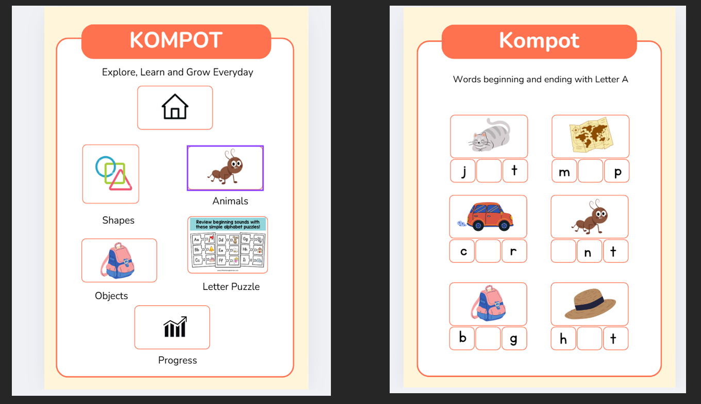

# Word Learning Game

## Prototype

### Objectives

The objectives of this prototype is to create an engaging and educational game that helps users expand their vocabulary through interactive gameplay. The prototype phase permits to experiment and take design decisions for the final product.

### Technical specifications

The protype has been made with a basic Vanilla HTML/CSS/JavaScript implementation.
This permitted fast iterations and rapid changes to be able to have a product working with all of its basic features.

The protoype is automatically deployed onto github pages to be able to share the prototype with clients or investors.
The code is also tested using github actions, thus the code tests are ran during merge onto the `main` branch.

## Final Product

### Objectives

The objectives of the final product is to create a polished and fully functional game that provides a seamless user experience, with additional features and improvements based on feedback from the prototype phase.
The final product aims to be a comprehensive tool for vocabulary building, suitable for a wide range of users.

### Technical Specifications

#### Frameworks

The final app will be developed using React and Typescript.
React will be used to permit higher modularity and better coherence of style over the whole website.
On the other hand, usage of typescript instead of javascript will permit to ensure the code quality due to its strong typing nature. Strong typing will also permit to have more robust testing, as edge cases will be reduced.

The product must answer to all the initial expectations and feature-complete. I.e. be user friendly and bug free.

#### CI/CD

Github Actions will permit to continuously test the sent code on two different events:

- on the creation of a pull request pointing to the `main` branch
- on a push commit to the `main` branch.

Ideally, the `main`shold also be protected in order to force CI checks before merge.

The deployment would be also handled by github actions, and will be deployed on push onto the `prod` branch.

#### Backend infrastructure

The production environment will use mangoDB to support user data. The front-end is deployed by the GitHub actions, and will be connected to the DB in order to interact with persistent data.

Docker will be used to ensure reproductible behaviors between development and production.

### Graphical Interface

A mock of a graphical interface has been protyped to what the final product should looks like.

### Possible enhancements

Once the base product is finished, the possibilities to expand the product are almost infinite.
Adding new features or play modes should be considered with other stakeholders.
